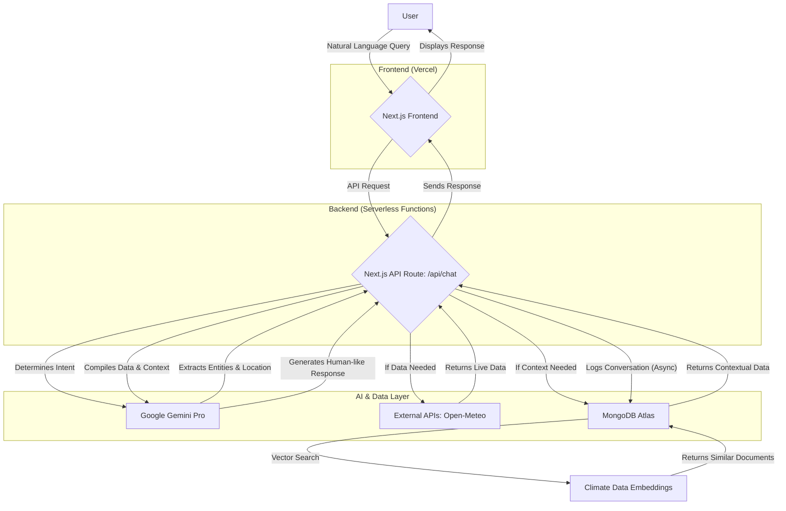

# Project Atlantis: The Search for a Lost World

Welcome to Project Atlantis, a groundbreaking conversational AI platform designed to democratize access to complex climate data and empower users with actionable, data-driven insights. Our mission is to transform the way we understand and interact with climate information, making it intuitive, immediate, and impactful for researchers, policymakers, and the public alike.

This is more than a data tool; it's a new way to have a conversation with our planet.

## The Architecture: An Intelligent Ecosystem

```
+------------------------+
|        USER           |
|  (Natural Language)   |
+------------------------+
          ↓
+------------------------+
| Next.js Frontend       |
| (React Components)     |
|  +-----------------+  |
|  | UI Components  |  |
|  +-----------------+  |
|  | Chat Interface |  |
|  +-----------------+  |
+------------------------+
          ↓
+------------------------+
| Next.js API Gateway    |
|  +-----------------+  |
|  | /api/chat      |  |
|  +-----------------+  |
|  | /api/data      |  |
|  +-----------------+  |
+------------------------+
          ↓
+------------------------+
|   Chat Service        |
|  +-----------------+  |
|  | Message Queue  |  |
|  +-----------------+  |
|  | Context Manager|  |
|  +-----------------+  |
+------------------------+
          ↓
+------------------------+
| Google Gemini Pro     |
|  +-----------------+  |
|  | Language Model |  |
|  +-----------------+  |
|  | Vector Search  |  |
|  +-----------------+  |
+------------------------+
          ↓
+------------------------+
| MongoDB Atlas         |
|  +-----------------+  |
|  | Climate Data   |  |
|  +-----------------+  |
|  | User Profiles  |  |
|  +-----------------+  |
|  | Conversation   |  |
|  +-----------------+  |
|  | History       |  |
+------------------------+
          ↓
+------------------------+
| External Data Sources  |
|  +-----------------+  |
|  | Open-Meteo     |  |
|  +-----------------+  |
|  | Climate Datasets|  |
|  +-----------------+  |
|  | Research Papers|  |
+------------------------+
```

Project Atlantis is built on a modern, serverless architecture designed for scalability, performance, and intelligence. The entire system works in a seamless flow, from the user's query to the synthesized, context-rich response.



### The Role of MongoDB Atlas: The Intelligent Data Foundation

At the heart of Project Atlantis lies **MongoDB Atlas**. It is not just a database; it is the lifeblood of our application, the engine that turns raw data into profound climate intelligence. We chose MongoDB for two critical reasons: its flexible document model and its state-of-the-art **Vector Search**.

Climate data is inherently messy, diverse, and semi-structured. MongoDB's JSON-like documents allow us to store this varied information—from satellite imagery metadata to historical weather patterns—in a single, unified repository without rigid schemas. This flexibility is paramount.

More importantly, we leverage **MongoDB's Vector Search** to find the hidden signals in the noise. By converting climate data points into high-dimensional vector embeddings, we can perform lightning-fast similarity searches. When a user asks, "Which areas are experiencing weather patterns similar to the 2012 Dust Bowl?", we aren't just querying for keywords. We are searching for conceptual similarity across millions of data points, uncovering analogous events and providing a level of context that would be impossible with traditional databases. This is the future of data analysis, and it's built on MongoDB.

### The Role of Gemini Pro: The Conversational Soul

If MongoDB is the foundation, **Google's Gemini Pro** is the soul of our platform. It is the user's brilliant and tireless research assistant. Gemini's role is twofold:

1.  **Intent Recognition & Orchestration:** Gemini first deciphers the user's natural language query. It understands the nuances of human language, extracts key entities (like locations, dates, and climate phenomena), and determines the user's underlying intent. It then acts as an orchestrator, deciding whether to fetch live data from an external API, query MongoDB for historical context, or simply provide a direct answer.

2.  **Synthesis & Narrative Generation:** Once the necessary data is gathered, it is handed back to Gemini. The model then synthesizes this raw information—live weather data, historical analogues from MongoDB, and its own vast knowledge base—into a clear, concise, and scientifically grounded narrative. It transforms tables of numbers into a story you can understand.

The synergy between Gemini's advanced reasoning and MongoDB's vector search capabilities creates a seamless and extraordinarily powerful analytical experience.

## File Structure

```
/Users/ayushsrivastava/OpenAPI/
├── .next/                     # Next.js build output
├── node_modules/              # Project dependencies
├── public/                    # Static assets (images, fonts)
├── src/
│   ├── app/
│   │   ├── api/                 # API routes (e.g., /api/chat)
│   │   │   └── chat/route.ts
│   │   ├── documentation/     # Documentation page
│   │   │   └── page.tsx
│   │   ├── news/              # News page
│   │   │   └── page.tsx
│   │   ├── globals.css        # Global styles
│   │   ├── layout.tsx         # Root layout with global sidebar
│   │   └── page.tsx           # Homepage component
│   ├── components/
│   │   ├── ui/                # Shadcn UI components
│   │   ├── ChatInput.tsx      # Reusable chat input component
│   │   ├── ContentFeed.tsx    # Content feed for the homepage
│   │   ├── FloatingChatContainer.tsx # Main chat interface
│   │   └── LeftSidebar.tsx    # Global navigation sidebar
│   └── lib/
│       └── utils.ts           # Utility functions (e.g., cn for Tailwind)
├── .env.local                 # Environment variables (GIT-IGNORED)
├── next.config.js             # Next.js configuration
├── package.json               # Project manifest
├── README.md                  # You are here!
└── tsconfig.json              # TypeScript configuration
```

## Getting Started

First, ensure you have Node.js and npm installed. Then, set up your environment variables by creating a `.env.local` file in the root directory:

```
GEMINI_API_KEY=your_gemini_api_key_here
MONGO_URI=your_mongodb_atlas_connection_string_here
```

Next, install the project dependencies:

```bash
npm install
```

Finally, run the development server:

```bash
npm run dev
```

Open [http://localhost:3000](http://localhost:3000) with your browser to see Project Atlantis in action.
